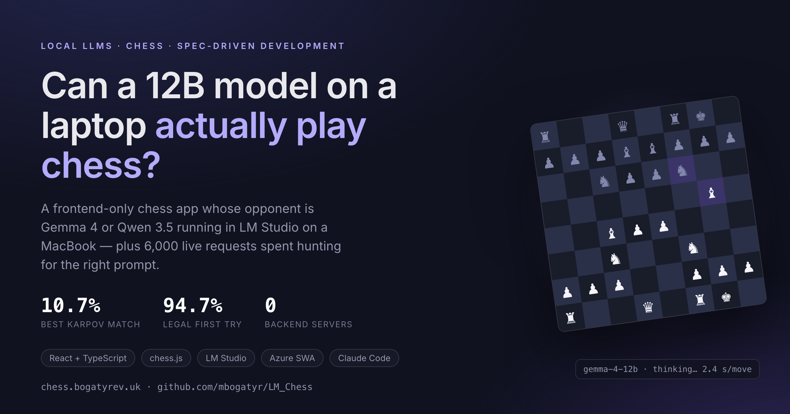
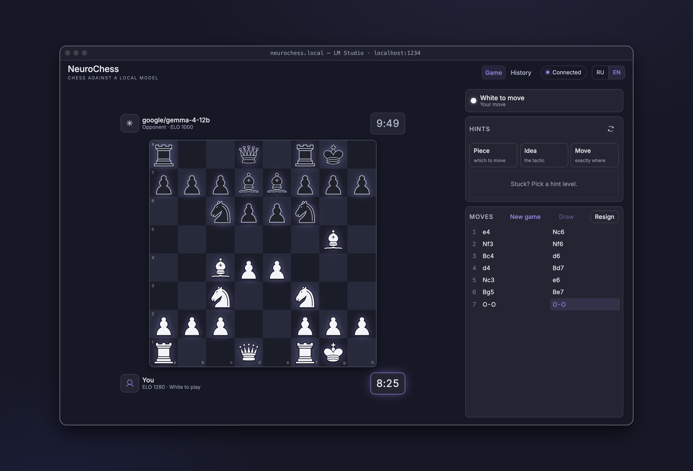
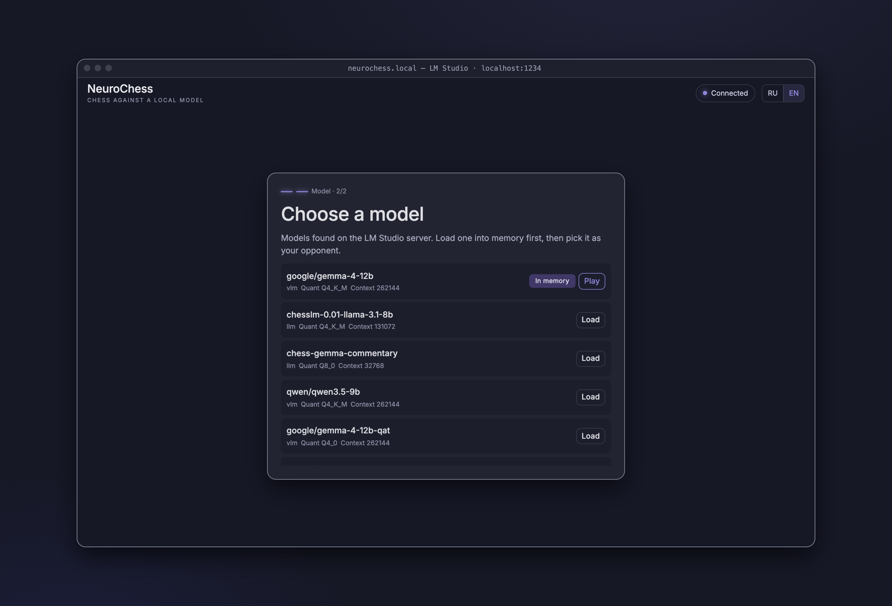
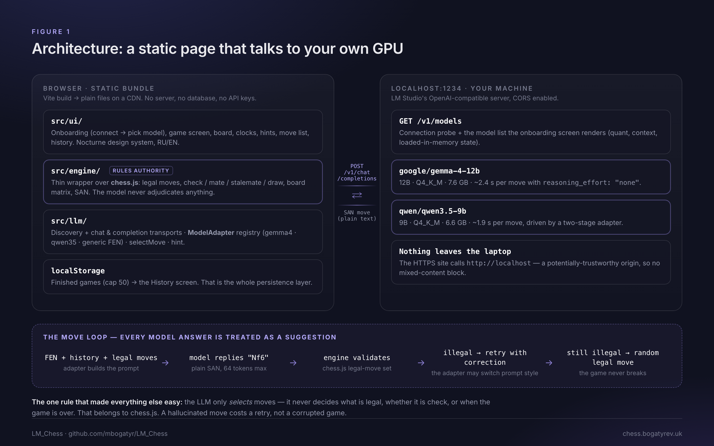
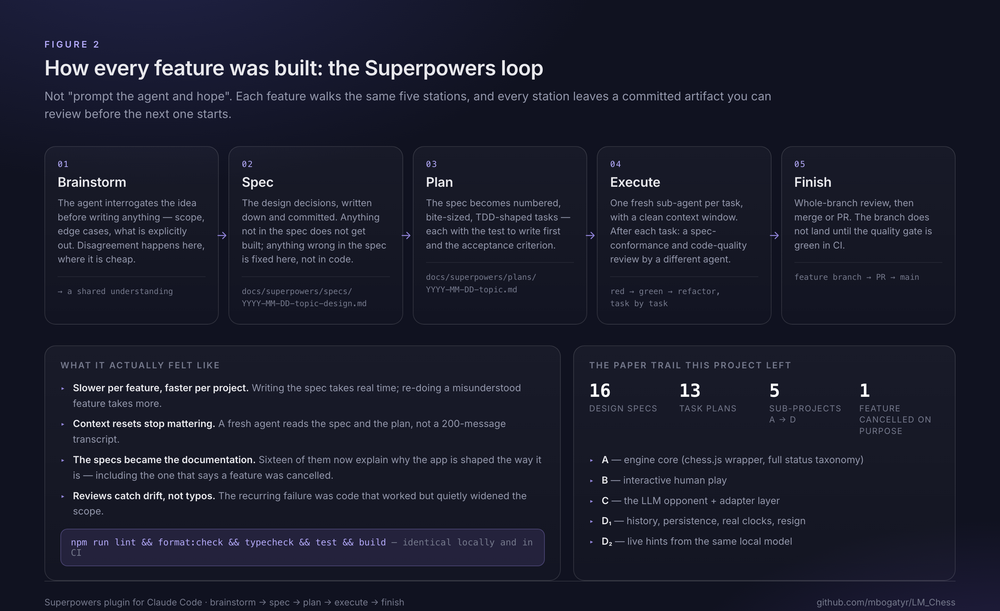
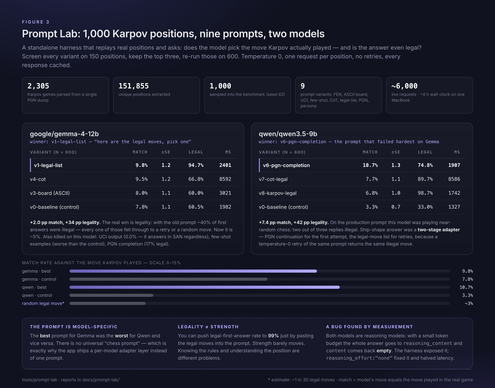
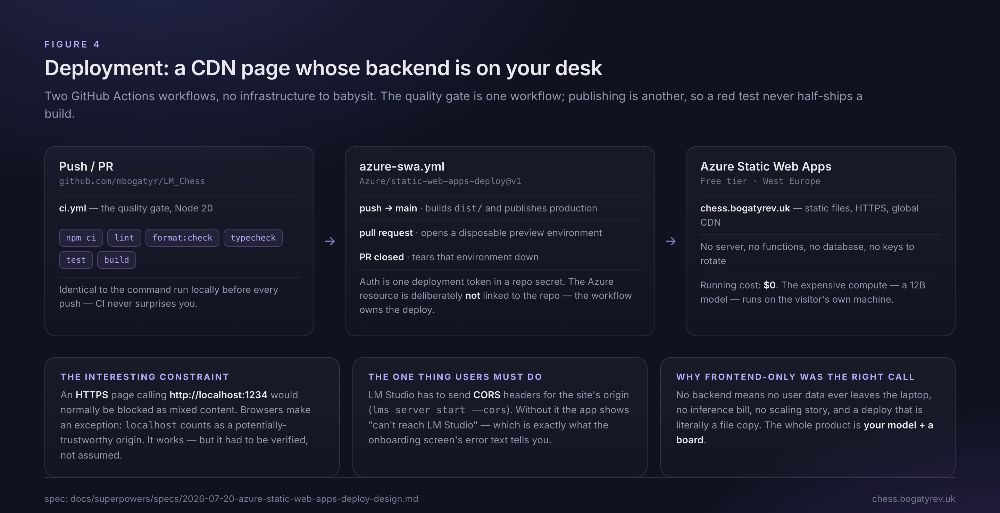

# I Spent 6,000 Prompts Teaching a Laptop-Sized LLM to Play Chess. It Still Can't.

_But the experiment was worth every one of them — and the way it was built turned out to be the more interesting result._



I started this project with two questions, one obvious and one sneaky.

The obvious one: **can a local LLM — Gemma 4 12B or Qwen 3.5 9B, running in LM Studio on a MacBook, no cloud, no API key — actually play chess?** Not "produce chess-shaped text". Play. Choose reasonable moves in real positions.

The sneaky one: **can I build a real product entirely through spec-driven development with an AI agent** — using the **Superpowers** skillset for Claude Code — instead of the usual "prompt, paste, pray" loop?

Spoiler for the first: no. Spoiler for the second: yes, and it changed how I work.

Both answers are live at **[chess.bogatyrev.uk](https://chess.bogatyrev.uk)**, with the code at **[github.com/mbogatyr/LM_Chess](https://github.com/mbogatyr/LM_Chess)**.

---

## What got built

NeuroChess is a chess app where your opponent is a model running on your own machine. You open the page, it finds your LM Studio server, lists the models you have downloaded, you pick one, and you play. The model is Black, you are White, both sides have ten minutes on the clock, and the model's clock ticks while it thinks.



That screenshot is a real game against `google/gemma-4-12b` — every Black move in the move list was chosen by a 12B model running locally, with a 7.6 GB memory footprint and about 2.4 seconds of thinking time per move. And honestly? `e4 Nc6 Nf3 Nf6 Bc4 d6 d4 Bd7 Nc3 e6 Bg5 Be7 O-O O-O` looks perfectly respectable. Hold that thought.

Onboarding is two steps, and step two is where the local-model story becomes concrete: the app reads the model list straight off LM Studio, including quantization, context length, and whether the model is already loaded into memory.



Also in there: live per-side clocks, a resign flow, a history screen for finished games, and a hint console that asks the same local model for one best move and reveals it progressively — piece type, then the idea, then the exact move highlighted on the board.

---

## The architecture, and the one rule that made it work



The whole app is **frontend-only**. React 18, TypeScript in strict mode, Vite. No backend, no database, no serverless functions, no secrets. It is a bundle of static files, and its "backend" is whatever GPU the visitor already owns.

The decision everything else hangs on: **the LLM never owns the rules**. [chess.js](https://github.com/jhlywa/chess.js) does. The model's only job is to _select_ a move; legality, check, checkmate, stalemate, the fifty-move rule, and "is this game over" all belong to the engine. So the move loop looks like this:

1. A per-model adapter builds a prompt from the position.
2. The model answers with a move in SAN — 64 tokens, temperature 0.
3. The engine checks it against the legal-move set.
4. If it's illegal, retry once with a correction (and, for some models, a _different_ prompt style).
5. If it's still illegal, play a random legal move.

That last step feels like a cop-out, but it's the reason the app never breaks. A hallucinated move costs a retry, not a corrupted game. It also gave me a brutally honest measuring stick later: **how often does the fallback fire?**

One integration detail that cost me real time and is worth stealing: both Gemma 4 and Qwen 3.5 are **reasoning models**. With a small `max_tokens` budget, the entire response goes into `reasoning_content` and `content` comes back **empty** — so the app saw an unparseable answer and quietly fell back to random moves. Passing `reasoning_effort: "none"` fixed it and roughly halved latency. If your local model returns empty strings, this is probably why.

---

## How it was built: spec-driven development with an agent



This is the part I'd defend more strongly than the chess result.

Every non-trivial feature walked the same five stations: **brainstorm → spec → plan → execute → finish**. Not as a slogan — as files. The brainstorm interrogates the idea before a line of code exists. The spec gets committed to `docs/superpowers/specs/`. The plan turns it into numbered, test-first tasks in `docs/superpowers/plans/`. Execution runs one fresh sub-agent per task, each with a clean context window, with a review pass by a _different_ agent after every task. Finishing means a whole-branch review, a feature branch, a PR, and a green CI.

The project ended up with **16 specs, 13 plans, 54 test files, and 293 tests**, and a quality gate that is byte-identical locally and in CI:

```bash
npm run lint && npm run format:check && npm run typecheck && npm test && npm run build
```

What I actually learned from working this way:

- **It is slower per feature and faster per project.** Writing a spec takes real time. Rebuilding a feature the agent misunderstood takes more.
- **Context resets stop being scary.** A fresh agent reads a spec and a plan, not a 200-message transcript. This is the single biggest practical win.
- **The specs became the documentation.** Sixteen documents now explain _why_ the app is shaped the way it is — including one that records a feature I decided to cancel, so nobody (human or agent) resurrects it by accident.
- **Reviews catch drift, not typos.** The recurring failure mode wasn't broken code. It was code that worked but quietly did more than the spec asked for.

Predictable, auditable, a little bureaucratic. For AI-assisted work, that trade is very good.

---

## Prompt Lab: the experiment I'd repeat

The app worked. The model played legal-ish chess. But "does the prompt matter, and how much?" is not a question you answer by vibes, so I built a measuring instrument.

**Prompt Lab** is a standalone harness that takes a PGN dump of **2,305 Karpov games**, extracts **151,855 unique positions**, samples **1,000** of them into a fixed benchmark, and then asks: given this position, does the model pick the move Karpov actually played — and is the answer even legal?

The protocol: screen every prompt variant on 150 positions, keep the top three, re-run those on 600. Temperature 0, one request per position, no retries, every response cached so re-runs are free. Nine variants: bare FEN, an ASCII board, UCI output, few-shot examples, brief chain-of-thought, "here is the list of legal moves, pick one", raw PGN continuation, and a grandmaster-persona variant.



The results were more interesting than the scores:

**The winning prompt is model-specific — dramatically so.** For Gemma 4, the winner was pasting the legal-move list into the prompt (9.8% match, 94.7% legal on the first try, up from 7.8% / 60.5%). For Qwen 3.5, the winner was **raw PGN continuation** — formatting the position as a game score and letting the model continue it (10.7% match, up from 3.3%). PGN continuation was the _worst_ variant on Gemma (17% legal). The best prompt for one model was near-useless on the other. That is exactly why the app ships a per-model adapter layer rather than one universal prompt.

**Legality and strength are different problems.** Pasting the legal moves into the prompt pushes first-answer legality to ~99%. It barely moves accuracy. The model can be taught what is _permitted_ almost instantly; being taught what is _good_ is another matter entirely.

**The baseline was worse than I thought.** On the app's original prompt, Qwen 3.5 answered illegally **two times out of three** — meaning most of its "moves" were actually the random fallback. It looked like it was playing. It wasn't.

**Qwen needed a two-stage adapter.** Its best prompt ignores correction feedback, and at temperature 0 a retry of the same prompt returns the same illegal move. So the shipped adapter uses PGN continuation for the first attempt and the legal-move list for retries: the strongest prompt when it works, the most obedient one when it doesn't.

Then I replayed the losing positions by hand, and the failure patterns were the real payoff. Gemma has a **checking reflex** — it reaches for checks, captures, and generic developing moves where Karpov played a quiet consolidating move. In one position it played `Qxd3+`, giving up its queen for a knight, apparently because the move came with check. Qwen fails differently: its moves are _PGN-plausible_, natural-looking continuations of a typical game that ignore what is concretely going on in front of it.

---

## Deployment: a CDN page whose backend is on your desk



Two GitHub Actions workflows: one is purely the quality gate, one publishes to Azure Static Web Apps (production on push to `main`, a disposable preview environment per pull request). Running cost: **$0**, because the only expensive compute — a 12B model — runs on the visitor's own machine.

The fun constraint: an **HTTPS** page calling **`http://localhost:1234`** should be blocked as mixed content. It isn't, because browsers treat `localhost` as a potentially-trustworthy origin. The one thing users must do is enable CORS in LM Studio (`lms server start --cors`); without it the app just says it can't reach the server.

---

## The verdict: the hypothesis did not survive

**Local 12B-class models cannot play chess.** They move pieces.

Look at the numbers honestly. The best prompt on the best model reproduces Karpov's move about **10.7%** of the time. Picking a random legal move gets you roughly 3% (there are usually ~30 legal moves). So the model is meaningfully better than random — and nowhere near a player. It has absorbed the _shape_ of chess from its training data: opening moves look sensible, developing moves look sensible, the first ten moves of a game can look genuinely fine. The moment the position needs a concrete plan — a queenside break, a prophylactic move, resolving a bind — it reaches for the move that _reads_ well: a check, a capture, a natural-looking regrouping.

And the accuracy ceiling barely moved across nine prompt variants and 6,000 requests. Prompting changed legality by 40 percentage points. It changed strength by 2–7. **Prompt engineering fixes the interface to the model, not the model.** A 1 MB chess engine from 1997 still plays infinitely better than 7.6 GB of transformer weights on your GPU — because chess is search, and these models are not searching.

That's not a disappointment. It's a clean result, and it's the kind you only get by building the measuring instrument instead of arguing about intuitions.

## What I'm taking with me

- **Give the LLM the narrowest possible job.** "Suggest a move" is a good job. "Decide what's legal" is not. Every deterministic component you can put between the model and your state is a bug you'll never have.
- **Measure prompts, don't debate them.** A one-evening harness produced a result I would never have guessed: that the best prompt for one model is the worst for another.
- **Assume nothing about local models.** The empty-`content` reasoning bug was invisible in the app and obvious in the harness.
- **Spec-driven development with an agent works.** It's slower, more deliberate, and far more predictable than conversational coding. For anything you intend to maintain, that's the trade you want.

---

🔗 **Live app:** [chess.bogatyrev.uk](https://chess.bogatyrev.uk) — you'll need [LM Studio](https://lmstudio.ai) with a model loaded and CORS enabled.
💻 **Source, specs, plans, and both Prompt Lab reports:** [github.com/mbogatyr/LM_Chess](https://github.com/mbogatyr/LM_Chess)

_Built with React 18, TypeScript, chess.js, Vite, and Claude Code + Superpowers. Deployed on Azure Static Web Apps._
